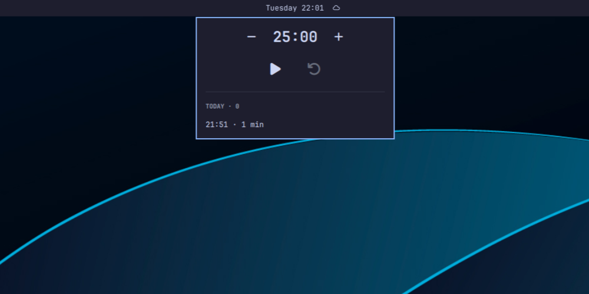

# Pomodoro (`io.github.nejcm.pomodoro`)

Omarchy Quickshell bar widget. Hourglass glyph while idle; the glyph is replaced
by a live `mm:ss` countdown while running, dimmed while paused. Click it to
open a panel with play/pause, reset, and a log of completed sessions below.



## Requirements

- Omarchy with the Quattro shell (`omarchy-shell`) — this is a `bar-widget`
  plugin and uses the shell's `qs.Ui` / `qs.Commons` modules.
- A Nerd Font as the bar font, for the hourglass, play, pause, and undo
  glyphs. Omarchy's default (JetBrainsMono Nerd Font) covers all four; a bar
  configured with a non-Nerd font renders them as tofu.
- `notify-send` (`libnotify`) for the completion notification, which ships with
  Omarchy. Absent, the notification is skipped silently; nothing else breaks.

No other dependencies: the plugin is four files of QML and JavaScript, and it
runs inside the existing shell process rather than spawning anything of its own
beyond `mkdir -p` for its state directory and `notify-send` on completion.

## Install

```bash
git clone https://github.com/nejcm/omarchy-pomodoro.git ~/.config/omarchy/plugins/io.github.nejcm.pomodoro
omarchy plugin validate ~/.config/omarchy/plugins/io.github.nejcm.pomodoro
omarchy-shell shell rescanPlugins
omarchy plugin enable io.github.nejcm.pomodoro --section right --before omarchy.power
```

Third-party plugins are discovered disabled; `omarchy plugin enable` turns this
one on after you have reviewed it, and writes the `bar.layout.right` entry for
you — no hand-editing of `shell.json` is needed to place it. Drop
`--before omarchy.power` to append instead, or use `--section left|center`.

Two things worth knowing:

- **Clone it, don't symlink it.** `omarchy plugin validate` rejects a symlinked
  plugin folder outright, so pointing the plugin directory at a working copy
  elsewhere does not work.
- A bar widget's *enablement is its layout entry*. The top-level `plugins`
  array in `shell.json` stays `[]`; that is expected, not a failed install.

## Uninstall

```bash
omarchy plugin remove io.github.nejcm.pomodoro --yes
```

That disables the plugin (removing its bar entry), deletes the cloned folder,
and rescans — the bar updates without a restart. Session history is deliberately
left behind so a reinstall picks it back up; delete it yourself if you want it
gone:

```bash
rm -f ~/.local/state/omarchy/pomodoro.json
```

The plugin writes nothing else outside its own folder. It never edits
`shell.json`; the `omarchy plugin enable`/`remove` commands above do, on your
say-so.

## Settings

Set under the widget's entry in `shell.json`:

| Key | Default | Description |
|---|---|---|
| `minutes` | `25` | Session length. Must be a JSON **number** in 1–180; anything else falls back to 25 |
| `notify` | `true` | Send a desktop notification on session completion. Must be a JSON **boolean** |

Types are checked strictly and fall back silently, so quote marks matter:
`"minutes": 30` works, `"minutes": "30"` leaves you on 25, and
`"notify": "false"` is not `false` — it reads as the default, `true`.

Settings go **inline on the entry**, as siblings of `id` — not nested under a
`settings` key:

```json
{
  "bar": {
    "layout": {
      "right": [
        {
          "id": "io.github.nejcm.pomodoro",
          "minutes": 25,
          "notify": true
        }
      ]
    }
  }
}
```

The bar builds a widget's settings by copying every key of the entry except
`id` (`plugins/bar/BarModel.js`, `entrySettings`), which is why a nested
`"settings": { … }` object would not work: `minutes` would silently stay at 25
while the config looked correct. The built-in `omarchy.clock` entry uses the
same inline shape.

`shell.json` hot-reloads, so a duration change applies on save. It takes effect
on the *next* session — an edit mid-session cannot yank time out from under a
running timer, and cannot relabel a session that has already finished.

## Usage

- Idle: hourglass glyph in the bar.
- Running: glyph is replaced by a `mm:ss` countdown; paused shows the same
  text at reduced opacity.
- Click the widget to open the panel: play/pause and reset controls above,
  a session log below.
- Reset stops the timer and restores the full duration without recording a
  history row.
- Completed sessions are recorded (no aborted sessions), newest first,
  capped at 50 rows.
- With the panel focused, Enter or Space starts and stops, and Escape closes.

## History

Stored at `~/.local/state/omarchy/pomodoro.json`. A running (or paused)
timer does **not** survive a shell restart — only completed-session history
persists.

If that file exists but cannot be parsed, the plugin stops saving rather than
overwrite it, and logs the path. That protects a file damaged by a truncated
write or a hand-edit, at the cost of new sessions going unrecorded until you
fix or delete it.

Multi-monitor: each bar surface runs its own timer and whole-file-writes
history on completion, so a dual-head setup can produce duplicate or
last-writer-wins history entries. See [improvements.md](improvements.md).

## Development

No build step and no npm dependencies. Two checks run on every pull request
and on pushes to `master` ([.github/workflows/checks.yml](.github/workflows/checks.yml)),
both runnable locally:

```bash
node Model.test.js
```

`Model.js` holds the pure logic (formatting, validation, history parsing and
capping) and `Model.test.js` is a plain `assert` self-check — no framework. The
second check parses `manifest.json`, which catches a typo that would otherwise
make the plugin silently undiscoverable.

The QML is not linted or covered by tests. `qmllint` was tried and removed:
Quickshell is AUR-only and `qs.*` is omarchy-shell's own module namespace, so
neither resolves on a stock runner, and every type in both files comes from one
of them — the run produced 317 warnings, none of them real. See
[improvements.md](improvements.md) for the measurement and the upgrade path.

## License

MIT — see [LICENSE](LICENSE).
